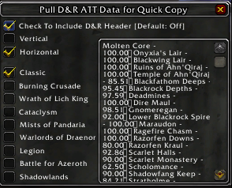
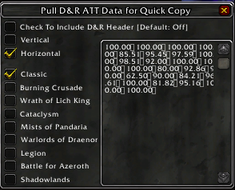
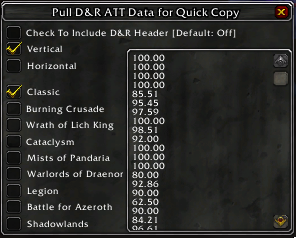

# Quick Copy/Paste from ATT Data
Tired of manually inputting numbers on your google drive or excel sheet to show off your dungeon & raid numbers on weekly reset day or save for personal purpose?!?  Fear not!  Now this can quickly help you pull data to copy then paste to your outside application (excel, google sheet, etc)  This addon will NOT save or write or anything to ATT, it only reads what's given from `All The Things`.

You will need to create an Google Drive or Excel Spreadsheet or whatever you perfer to use.  Or you can use prepared sheet for you, you can always modify the sheet to suit your needs!

No macro/script, Only Condition Formatting, link below:

  Google Drive Sheet:
  https://docs.google.com/spreadsheets/d/10gNgY-IVCehRHCNCs4xlRHdIQmABCUcT7KAK2zb6HOA/edit?usp=sharing
  
  Excel Spreadsheet (2007):
  https://drive.google.com/file/d/12sU2SwXDNQd6KsOKRG_oCW2_13TzbMDu/view?usp=sharing

## About Me
I'm Vandiel, in ATT on Discord (Vandiel#2276) and on Korgath.  I'm by no means a expert programmer/coder, but like to learn and experiment things.  I'm always happy to have some insight and/or improvement to the code.

## Contribute
Please report bugs on the [Github Issue Reporting] https://github.com/vandiel01/QuickCPATT/issues/new.

The use of [BugGrabber] https://www.curseforge.com/wow/addons/bug-grabber and [BugSack] https://www.curseforge.com/wow/addons/bugsack will help tremendously with the debugging process.

You can also contribute to the addon by [Donate] https://paypal.me/Vandiel01

## How To Use
/qcp or /quickcp to use `Quick Copy/Paste`

## Future Feature/Thoughts?
-Any new reasonable ideas are welcome :)

## Image Samples

